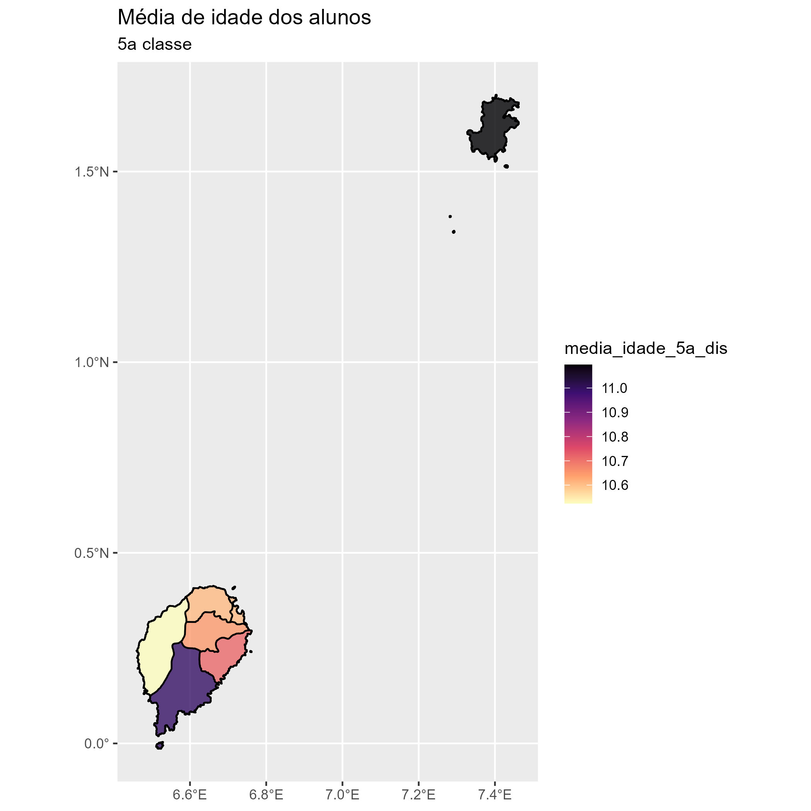

```{r xaringan-themer, include=FALSE, warning=FALSE}

library(xaringanthemer)
style_duo_accent(primary_color = "#116116", secondary_color = "#C62C2C")

Sys.setenv(TZ="America/Lima")

knitr::opts_chunk$set(warning = FALSE, message = FALSE) 
```


## Preâmbulo

- Apagando tudo no ambiente

```{r eval=FALSE}
rm(list=ls()) # apaga tudo no ambiente
```

- Instalar os pacotes de que precisarás
  - Pacotes padrão (CRAN) podem ser instalados com:

```{r eval=FALSE}
install.packages("devtools")
```

  - Outros pacotes armazenados no github precisam do Devtools::
```{r eval=FALSE}
devtools:: install_github("data-edu/dataedu")
```

- Depois precisamos carregar os pacotes
  - Notem que não precisamos das aspas
```{r eval=FALSE}
library(devtools)
```

---
## Preâmbulo

- O pacote "pacman" já inspeciona quais pacotes tens instalados, instala o que não tiver sido instalado e já carrega os pacotes

```{r eval=FALSE}
pacman:: p_load(tidyverse, apaTables, sjPlot,
                readxl, dataedu, zelador, epiDisplay)
```

Para São Tomé e Príncipe, é importante acertar a hora do R:
```{r eval=FALSE}

Sys.setenv(TZ="UCT") # Acerta a hora de STP
```

---

# Preâmbulo: Os caminhos

- Os caminhos servem para organizar o trabalho
  - São cruciais para trabalhar colaborativamente!
  - Para alterar de um computador para o outro, basta modificar a linha "root"
  
```{r eval=FALSE}
# Paths
root     <- "C:/Users/vitor/Dropbox (Personal)/Sao Tome e Principe/2022/Boletim_estatisco/"
input    <- paste0(root, "input/")
output   <- paste0(root, "output/")
tmp      <- paste0(root, "tmp/")
code     <- paste0(root, "code/")
alunos   <- paste0(root, "alunos/")
setwd(root)
```

```{r, results='hide', warning=FALSE, message=FALSE, fig.show='hide'}
pacman:: p_load(magrittr, dplyr, vctrs, readr, ggplot2, sf,
                janitor, readxl, gt, epiDisplay, gapminder,
                data.table, formattable, tidyr, crosstable)

# Paths
root     <-  "C:/Users/Utilizador/Desktop/R_STP/"
input    <- paste0(root, "input/")
output   <- paste0(root, "output/")
tmp      <- paste0(root, "tmp/")
code     <- paste0(root, "code/")
alunos   <- paste0(root, "alunos/")

# Le todas as colunas e decide quais sao numericas
col_types <- readr::cols(.default = readr::col_character())

# Acerta a hora de STP
Sys.setenv(TZ="UCT")
#######################################

basica            <- clean_names(as.data.frame(read_excel(paste0(input, "BASE BÁSICO - inicio ano 2021-2022.xlsx"), sheet = "Base Aluno")))
secundaria_7_9    <- clean_names(as.data.frame(read_excel(paste0(input,"Base Dados inicio Secundario -18-07-2022.xlsx"), sheet="Alunos 7ª- 9ª classes")))
secundaria_10_12  <- clean_names(as.data.frame(read_excel(paste0(input,"Base Dados inicio Secundario -18-07-2022.xlsx"), sheet="Alunos 10ª- 12ª Classes")))

basica <- basica %>% # o pipe indica que estamos a ultizar a base chamada basica
  remove_empty(c("rows", "cols")) %>% #retiramos as linhas e colunas vazias
  dplyr::select(-codigo_escola) %>%  # ficamos com todas as colunas, excepto o codigo_escola
  mutate(across(.fns = as.character)) # transformamos todas as colunas em texto

secundaria_7_9 <- secundaria_7_9 %>% 
  remove_empty(c("rows", "cols")) %>% 
  dplyr:: select(-codigo_escola)  %>% 
  mutate(across(.fns = as.character))

secundaria_10_12 <- secundaria_10_12%>% 
  remove_empty(c("rows", "cols"))  %>% 
  dplyr::select(-codigo_escola)  %>% 
  mutate(across(.fns = as.character))

# Teste se as colunas sao iguais
# all.equal(secundaria_7_9_v2,secundaria_10_12_v2,
#          ignore_col_order=TRUE )

# Append- agregacao das bases, uma base em cima da outra
base_alunos <- bind_rows(basica, secundaria_7_9, # append das bases
                         secundaria_10_12) %>%
  mutate(distrito=replace(distrito, # corrige o distrito
                          distrito=="LOBATA","Lobata"), 
         classe = gsub("ª", "", classe)) # Tira o "ª" 

#transforma de volta as colunas numericas para o formato de numero  
base_alunos <- readr::type_convert(base_alunos) 

tab1(base_alunos$distrito)
tab1(base_alunos$idade)
tab1(base_alunos$classe)

base_alunos <- base_alunos %>% 
  mutate(distorcao = case_when(
    idade-classe-5 >=2 ~ "Em distorção",
    idade-classe-5 < 2 ~ "Fora de distorção" )) 

# Vamos retirar as bases que não vamos mais usar
rm(list = c("basica", "col_types",
            "secundaria_7_9", 
            "secundaria_10_12"))

tab1(base_alunos$distorcao)

base_alunos <- base_alunos %>% 
  mutate(classe_f=factor(classe))

```


- Atenção: 
  - As barras são para a direita!
  - As vezes o cominho fica muito longo e o R não consegue ler. Nesse caso, é melhor salvar a pasta do projeto em C:\

---

# Preâmbulo: Último passo...

- Se precisarmos em algum momento passar toda a base para caractere ( para poder fazer o append/rbind/apensar bases na vertical)


```{r eval=FALSE}
# Le todas as colunas e decide quais sao numericas
col_types <- readr::cols(.default = readr::col_character())
```

- Essa linha será aproveitada depois quando for converter de volta as colunas com números para fomato numérico. Não se esqueça de carregar o pacote readr

```{r eval=FALSE}
#transforma de volta as colunas numericas para o formato de numero  
base_alunos <- readr::type_convert(base_alunos) 
```


- Por último, separe visualmente cada parte do código

```{r eval=FALSE}
#######################################
```

- Atenção: Comentem abundantemente seus códigos com o cardinal

---

# Como abrir a base

- A forma de abrir a base dependerá do formato da base

- Arquivos em csv podem ser abertos através do pacote readr()

```{r eval=FALSE}
pacman:: p_load(readr)
iris <- read_csv("iris.csv")
```

- Arquivos de excel em xlsx podem ser abertos atravé do pacote readxl. Observe que precisamos nomear o ficheiro e a folha.

```{r eval=FALSE}
pacman::p_load(readxl)
basica<-read_excel(paste0(input, "BASE BÁSICO - inicio ano 2021-2022.xlsx"), sheet = "Base Aluno")
```

---
# Como abrir a base

- Arquivos em stata precisam do pacote readstata13

```{r eval=FALSE}
pacman::p_load(readstata13)
dat <- read.dta13("TEAdataSTATA.dta")
```

- Arquivos em SPSS dependem do pacote 

```{r eval=FALSE}
pacman::p_load(haven)
dataset = read_sav(path)
```

- Arquivos em txt
```{r eval=FALSE}
df <- read.table("dataset.txt", header=TRUE, sep=",")
```

---

# Visualizando a base

- Os comandos View(), head(), str(), tab1()  e summary() servem para inspecionar a base de dados

```{r eval=FALSE}
# vamos abrir o pacote
library(readr)
library(epiDisplay)
iris <- read_csv("iris.csv")
head(iris) #primeiras linhas
str(iris) # estrutura da base
View(iris) # abre a base para poder olhar
summary(iris) # faz um resumo da base
tab1(iris$sepal.length)
```

_ O str mostra a estrutura da base
- Não confundam summary com summarise. O summary() vai dar um resumo de cada variável
- O tab1 depende do pacote epiDisplay

---
# Como limpar as bases

- Os nomes das colunas das bases não podem ter espaços, nem traços, nem caracteres especiais
- Para limpar esses nomes, basta utilizar o comando clean_names() do pacote janitor()

```{r eval=FALSE}
# Limpando os nomes das variáveis
pacman::p_load(janitor)
pre_survey <- clean_names(dataedu::pre_survey)
```

---
# Como limpar as bases

- Os nomes de algumas colunas podem vir muito grandes ou ser pouco informativos. Para modificar, utilizamos o comando rename()

```{r eval=FALSE}
# renomear variaveis
pre_survey <- pre_survey %>%
  rename(
    q1 = q1maincellgroup_row1 , 
    q2 = q1maincellgroup_row2 , 
    q3 = q1maincellgroup_row3 , 
    q4 = q1maincellgroup_row4 , 
    q5 = q1maincellgroup_row5 , 
    q6 = q1maincellgroup_row6 , 
    q7 = q1maincellgroup_row7 , 
    q8 = q1maincellgroup_row8 , 
    q9 = q1maincellgroup_row9 , 
    q10 = q1maincellgroup_row10, 
    usuario = opdata_username, 
    curso = opdata_course_id
    ) 
```
---

# Remover colunas e linhas vazias

- Para remover as colunas e linhas vazias, utilze o comando remove_empty(), do pacote janitor

```{r eval=FALSE}
# Remove as linhas e colunas vazias
 remove_empty(c("rows", "cols"))
```

---

# Limpar o conteúdo das variáveis

- É possível retirar caracteres especiais
  - Dentro de uma pipe(%>%), coloque:
  
```{r eval=FALSE}
   classe = gsub("ª", "", classe)) # Tira o "ª" 
```

- Nesse exemplo, retiramos todos símbolos "ª" da variável classe, permitindo convert-la para números 

---

# Limpar o conteúdo das variáveis

- Também é possível modificar o conteúdo de uma variável. 

- Para isso, vamos utilizar os comandos mutate() e replace() do pacote dplyr()

```{r eval=FALSE}
pacman::p_load(dplyr)
# Append- agregacao das bases, uma base em cima da outra
base_alunos <- base_alunos %>% 
  mutate(distrito=replace(distrito, # corrige o distrito
                          distrito=="LOBATA","Lobata"))
```

---

# Limpar o conteúdo das variáveis

- Também é possível utilizar o comando case_when () do mutate() e dplyr() 

- Também podemos utilizar o mutate(case_when()) para criar novas variáveis. Exemplo:

```{r eval=FALSE}
base_alunos <- base_alunos %>% 
  mutate(distorcao = case_when(
    idade-classe-5 >=2 ~ "Em distorção",
    idade-classe-5 < 2 ~ "Fora de distorção" )) 
```


---

# Substituindo o texto de uma variável

- Para substituir o texto dentro de uma variável, utilizamos o comando **gsub**. 

```{r eval=FALSE}
base_alunos <- base_alunos %>% 
mutate(classe = gsub("ª", "", classe)) # Tira o "ª" 
```
- Notem que a variável era de texto, e quando tiramos o "ª", ela continua de texto. Se quiséssemos transfor-la em numérica, aplicar+iamos o comando **as.numeric**

```{r eval=FALSE}
base_nova <- secundaria_7_9 %>% 
  mutate(classe = gsub("ª", "", classe))%>% # Tira o "ª" 
  mutate(classe= as.numeric(classe)) # transforma em número

```
_ Para fazer o contrário (de numérico para texto), usamos o comando **as.character**


---

# O tipo de variável "fator" (factor)

Um tipo de variável cum e bastante utilizado em análises econométricas e para formaçºao de tabelas é o factor

 O r interpreta o factor como uma  variável de "camadas". 
 
Observe a diferença do comando cross table quando utilizamos uma variável numérica e quando a transformamos em factor

```{r eval=FALSE}
crosstable(base_alunos, c(classe_f), by=c(distorcao), total="both", 
           percent_pattern="{n} ({p_row})", percent_digits=0) %>%
  as_flextable()
```


---

# Sem o factor

```{r echo=FALSE}
crosstable(base_alunos, c(classe), by=c(distorcao), total="both", 
           percent_pattern="{n} ({p_row})", percent_digits=0) %>%
  as_flextable()
```
 
---

# Com o factor

```{r echo=FALSE}
crosstable(base_alunos, c(classe_f), by=c(distorcao), total="both", 
           percent_pattern="{n} ({p_row})", percent_digits=0) %>%
  as_flextable()
```

---

# Manipulando os dados: O dplyr

- O pacote dplyr possui alguns comandos bastante importantes:

select() - seleciona colunas
arrange() - ordena a base
filter() - filtra linhas
mutate() - cria/modifica colunas
group_by() - agrupa a base
summarise() - sumariza a base


---

# Exemplos- dplyr: O mutate

```{r eval=FALSE}
- Mutate para criar uma nova variável categórica

measure_mean <- measure_mean %>% 
  mutate( construto = case_when(
      questao %in% c("q1", "q4", "q5", "q8", "q10") ~ "interesse" ,
      questao %in% c("q2", "q6" , "q9") ~ "utilidade do curso", 
      questao %in% c("q3", "q7") ~ "competencia percebida"))
```

---

# O mutate(case_when)


- O case_when nos permite criar uma variável nome, modificando uma outra variável. 

- Podemos criar categorias, intervalos, etc....

- Note a sintaxe: Primeiro vem o valor antigo, e o valor que queremos criar vem depois **~**


- Exemplo:

```{r eval=FALSE}
ciclo <- base_alunos %>% 
  mutate(case_when(
    classe == 1 ~ "1o ciclo", 
    classe == 2 ~ "1o ciclo", 
    classe == 3 ~ "2o ciclo", 
    classe == 4 ~ "2o ciclo"  ))

```

---

# O mutate(case_when)

- Outro exemplo: Criamos um código para cada distrito


```{r eval=FALSE}
        mutate(ADM2_PCODE=
           case_when(distrito == "R.A.Príncipe" ~ "ST0101" , 
                     distrito == "Água Grande"  ~ "ST0201" ,
                     distrito == "Cantagalo"    ~ "ST0202" ,
                     distrito == "Caué"         ~ "ST0203" ,
                     distrito == "Lembá"        ~ "ST0204" ,
                     distrito == "Lobata"       ~ "ST0205" ,
                     distrito == "Mé-Zochi"     ~ "ST0206")) 
```

---

# O mutate(case_when)

- Outro exemplo: Aqui, a variável country deve ser vazia ("") para todos os países, exceto São Tomé e Príncipe

```{r eval=FALSE}
base_stp <-base_gapminder %>% 
  mutate(pais_STP=case_when(
    country == "Sao Tome and Principe" ~ "STP", 
    country != "Sao Tome and Principe" ~ "" ))
```

Note que poderíamos ter alcançado o mesmo resultado com **TRUE~""**

```{r eval=FALSE}
base_stp2 <-base_paises %>% 
  mutate(pais_STP2=case_when(
    country == "Sao Tome and Principe" ~ "STP", 
    TRUE ~""))
```

---

# Outro exemplo de mutate, com **%in%**

- Nesse caso, se a variável questão possui alguns dos valores "q1", "q4", "q5", "q8", "q10", então retorna "interesse", e por aí vai


```{r eval=FALSE}
measure_mean <- measure_mean %>% 
  mutate( construto = case_when(
      questao %in% c("q1", "q4", "q5", "q8", "q10") ~ "interesse" ,
      questao %in% c("q2", "q6" , "q9") ~ "utilidade do curso", 
      questao %in% c("q3", "q7") ~ "competencia percebida"))
```

- Note que economizamos muitas linhas com essa notação

---

# Exemplos- dplyr: O select

- O comando select irá selecionar as colunas desejas
```{r eval=FALSE}
basica <- basica %>% 
  dplyr::select(codigo_escola) %>%  # Ficamos apenas com o códiugo da escola
```

- Se você quiser todas as colunas, exceto algumas, basta colocar o símbolo de menos (-) antes da variável que desejas excluir. 

```{r eval=FALSE}
basica <- basica %>% 
  dplyr::select(-codigo_escola) %>%  # ficamos com todas as colunas, excepto o codigo_escola
```

---

# Exemplos- dplyr: O filter()

- O filter seleciona as linhas. 

- **Não confundir com o select, que seleciona colunas!**

```{r eval=FALSE}
base_alunos2<- base_alunos %>% 
  filter(distrito=="Água Grande")  # ficamos apenas com as observaçºoes referentes a Água Grande

```


---
--- 

# Exemplos- dplyr: O arrange()

- O arrange organiza a base na ordem das variáveis que quiseres

```{r eval=FALSE}
dat5 <- course_data2 %>% 
  arrange(usuario, curso, gradebook_item)
```

- Nesse exemplo, o R irá ordenar a base por ordem de usuário. 
  - Se houver duas ou mais linhas com o mesmo usuário, o R irá ordená-las pela ordem do curso.     
    - Se houver duas ou mais linhas com o mesmo usuário e curso, o R irá ordenar as linhas pela variável "gradebook_item"      
  


---

# O group_by e o summarise


- O comando group_by() irá agrupar "virtualmente" a base de dados de acordo com os valores de uma coluna. Em geral, é utilizado logo antes de uma operação em que a base será reduzida/colapsada através do summarise

```{r eval=FALSE}
medias_construto <- measure_mean %>% 
  group_by(construto) %>% 
  summarise( 
    # Média
    media_respostas = mean(resposta, na.rm=TRUE),
    # Mediana
    median_repostas = median(resposta, na.rm=TRUE), 
    # Desvio Padrao
    desv_pad_repostas = sd(resposta, na.rm=TRUE),
    # Percentual de missings
    perc_missing    = mean(is.na(resposta), 
    # Total de linhas
    total_respostas = n() ,
    # Número de valores distintos de escolas
    total_escolas= n_distinct(school) )
```

---

# O group_by e o summarise

- Observe o exemplo abaixo. 
- O que faz o comando **na.rm=TRUE** ?

```{r eval=FALSE}
# Vamos fazer as medias por construto
medias_construto <- measure_mean %>% 
  group_by(construto) %>%  # agrupa por construto
  summarise( media_respostas = mean(resposta, na.rm=TRUE), # media
             median_repostas = median(resposta, na.rm=TRUE), # mediana
             desv_pad_repostas = sd(resposta, na.rm=TRUE), # desvio padrao
            n_ordem = row_number()), # nuero da linha 
            perc_missing    = mean(is.na(resposta)) # percentual de missings
             
             )
```

- A última linha calcula o percentual de missings. Repare que **is.na** seleciona apenas as linhas com **missings*

---
 
# Distinct

- O comando distinct nos permite tirar os valores repetidos, seja uma linha inteira repetida, ou valores repetidos de uma variável

- **distinct**, portanto, pega apenas valores distintos

```{r eval=FALSE}
distinct(pre_survey4, usuario, curso)
```


---
--- 
 
  ## Transformando todas as colunas em texto
 
 - As vezes , para fazer uma junção na vertical, precisamos passar todas as colunas para texto.
 
  - Por que? Porque o formato de cada coluna deve ser o mesmo. Se uma delas é diferente, teremos um erro. 

```{r eval=FALSE}
# transforma tudo em texto
base_alunos %>%  base alunos %>% 
  mutate(across(.fns = as.character)) # transformamos todas as colunas em texto
```

- Depois de feito o append/rbind, é importante voltar com as colunas numéricas

```{r eval=FALSE}
base_alunos <- bind_rows(basica, secundaria_7_9, 
      secundaria_10_12) %>% # append das bases
# Converte de volta
  base_alunos <- readr::type_convert(base_alunos)
```

---

# Salvando e abrindo bases no formato R

-Para salvar a base no formato R, utilzamos o comando **saveRDS**

```{r eval=FALSE}
#save.image(file = paste0(tmp,"alunos_todos.RData"))
saveRDS(base_alunos, file = paste0(tmp,"alunos_todos_v2.RData"))
```

-Para abrir a base, utilizamos o **readRDS**

```{r eval=FALSE}
# Abre a base dos alunos
base_alunos<- readRDS(paste0(tmp,"alunos_todos_v2.RData"))
```

---

# Unindo bases (vertical)

- Para fazer a união das base na vertical, utilizamos o **bind_rows**
- Faz a união coluna a coluna


- No stata, essa operação é chamada de "append"

---

# Unindo bases (vertical)

```{r eval=FALSE}

# Append- agregacao das bases, uma base em cima da outra
base_alunos <- bind_rows(basica, 
                         secundaria_7_9,
                         secundaria_10_12)
# append das bases
 
```

---
--- 
# Unindo bases (horizontal)

- Para fazer a união linha a linha, na horizontal, utilizamos o comando **join**, com suas variações


---

# Unindo bases (horizontal)

- A união mais comum e mais útil é o left join.  Ele preserva as linhas que estão na base da esquerda e elimina as linhas que apenas aparecem na base da direita

```{r eval=FALSE}
# Left join
dat <- pre_survey4 %>% 
  left_join(course_data2, by = c("usuario", "curso"))  %>% 
  arrange(usuario, curso, gradebook_item)
```

- O inner join preserva apenas as linhas idênticas
```{r eval=FALSE}
# Inner join
dat2 <- pre_survey4 %>% 
  inner_join(course_data2, by = c("usuario", "curso"))  %>% 
  arrange(usuario, curso, gradebook_item)
```

---
# Unindo bases (horizontal)

- O full join preserva todas as linhas das duas bases

```{r eval=FALSE}
# Full join
dat3 <- pre_survey4 %>% 
  full_join(course_data2, by = c("usuario", "curso"))  %>% 
  arrange(usuario, curso, gradebook_item)
```

- O anti join preserva apenas as linhas que **NÃO** fizeram par

```{r eval=FALSE}
# anti_join
dat6 <- pre_survey4 %>% 
  anti_join(course_data2, by = c("usuario", "curso"))  %>% 
  arrange(usuario, curso )
```

---
# Pivotando a base (tidyr)

- Muitas vezes, precisamos colocar colunas em linhas e linhas em colunas

- Podemos trocar entre os formatos wide e long


--- Pivot longer 

- O **pivot_longer** transforma uma base em long (a original era wide)

Exemplo:
```{r eval=FALSE}

measure_mean <- pre_survey2 %>% 
  pivot_longer(cols = q1:q10, 
               names_to = "questao", 
               values_to = "resposta")
```

- Nesse exemplo, temos várias colunas contendo q1, q2, q3, etc...
- O nome das colunas será armazenado na coluna "questao"
- O valor das colunas será armazenado na coluna "resposta"

--- Pivot wider 

- O pivot wider transforma uma base em wide (a original era long). 

- O pivot_wider é um pouco mais complicado, pois pode aninhar linhas, inserindo vetores dentro de célular

- Precisamos dizer quis colunas identificam as linhas e, ao final do código, utilizar o comando **unnest()**

```{r eval=FALSE}
base_original <- measure_mean %>% 
  pivot_wider(id_cols= c("usuario","curso"), 
              names_from="questao", 
              values_from="resposta")%>% 
  unnest()
```

---

# Fazendo gráficos com o GGPLOT2

- Primeiro, carregue o pacote ggplot2 com o pacman

```{r eval=FALSE}
pacman:: p_load(ggplot2)
```

- Para fazer o gráfico, é importante que a base esteja preparada para ser representada em forma de gráfico

```{r, results='hide' }
base_graf1 <- base_alunos %>% 
  mutate(idade_ideal=classe+5) %>% 
  mutate(desvio_idade= idade-idade_ideal) %>% 
  group_by(classe, distrito) %>% 
  summarise(media_desvio_idade=mean(desvio_idade)) 
```

---
# Graficos

- Para fazer o gráfico, usamos a funçºao ggplot, e inseremos a estatica no aes(). 

- Observe aqui, que estamos a dizer o que deve ficar no eixo x, no eixo y, e as cores do grafico.

- Por último, damos a geometria (geom), que diz o tipo de grafico

```{r eval=FALSE}
grafico1<- base_graf1 %>% 
  ggplot(aes(
    x=classe, 
    y=media_desvio_idade, 
    color=distrito)) +
  geom_line()+
  geom_point() +
 labs(title="Desvio da idade ideal por classe")+
 xlab("classe")
```


---

# Graficos

```{r, echo=FALSE, warning=FALSE, message=FALSE,  fig.width=10, fig.height=6}
grafico1<- base_graf1 %>% 
  ggplot(aes(
    x=classe, 
    y=media_desvio_idade, 
    color=distrito)) +
  geom_line()+
  geom_point() +
 labs(title="Desvio da idade ideal por classe")+
 xlab("classe") + ylab("Desvio da idade em relação à idade correta para a classe") +
  scale_x_continuous(breaks = seq(1,12, 1))
grafico1
```


---

# Explicando: Como fizemos o gráfico?

- 1 - A base precisa estar formatada para o gráfico

- 2 - Recebemos a base, e depois da **pipe (%>%)**, abrimos a sintaxe do ggplot.

  - Nesse momento, precisamos dar a est+etica do gráfico (**aes**). A estética nos diz qual é o eixo x, o eixo y, as cores, etc...) 
    
```{r eval=FALSE}
grafico1<- base_graf1 %>% 
  ggplot(aes(
    x=classe, 
    y=media_desvio_idade, 
    color=distrito))
```


---

# Como fizemos o gráfico? A geometria

- Depois precismos dizer o tipo (geometria) do gráfico. Isso é feito, nesse caso, através do **geom_line()**.

- Podemos sobrepor diferentes geometrias. Por exemplo, podemos colocar pontos: **geom_point**

- Para ir adicionando camadas, utilizamos o símbolo da soma **+**


```{r eval=FALSE}
grafico1<- base_graf1 %>% 
  ggplot(aes(
    x=classe, 
    y=media_desvio_idade, 
    color=distrito)) +
  geom_line()+
  geom_point() 
```

---

# Como fizemos o gráfico? Detalhes

- Por último, adicionamos os últimos detalhes, como:

  - Título
  - Nome do eixo X e do eixo Y
  - A escala do eixo X e os pontos de quebra (break points) do eixo x 

```{r eval=FALSE}
grafico1<- base_graf1 %>% 
  ggplot(aes(
    x=classe, 
    y=media_desvio_idade, 
    color=distrito)) +
  geom_line()+
  geom_point() +
 labs(title="Desvio da idade ideal por classe")+
 xlab("classe") + ylab("Desvio da idade em relaçºao à idade correta para a classe") +
  scale_x_continuous(breaks = seq(1,12, 1))
```

---

# Tipos de geometria

- Linha: **geom_line**
- Ponto: **geom_point**
- Barra: **geom_bar**
- Boxpot: **geom_boxplot**
- Histograma: **geom_histogram**
- Violino: **geom_violin** 
- Estima relação entre variáveis: **geom_smooth**
- Montanhas empilhadas: **geom_density_ridges**  (precisa instalar o pacote **ggridges**)

- O copito doo ggplot2 contém dicas das geometrias mais comuns
  - [Clique aqui para baixar o copito do ggplot2 !](https://raw.githubusercontent.com/rstudio/cheatsheets/main/translations/portuguese/data-visualization_pt.pdf)


---

# Pirâmide etária nas escolas de STP

- Primeiro vamos organizar a base

```{r , warning=FALSE, message=FALSE}
# Abre a base dos alunos
base_piramide <- base_alunos %>% 
  group_by(sexo, idade) %>% 
  summarise(contagem_alunos = n()) %>% 
  mutate(contagem_alunos= 
           replace(contagem_alunos, 
                   sexo=="F", (-1)* contagem_alunos)) %>% 
  arrange(idade, sexo)
```

- Observe o replace.... Invertemos a contagem do número de meninas multiplcando por -1. Assim, as barras das meninas ficarão para a esquerda, e a dos meninos para a direita.

---

# Pirâmide etária nas escolas de STP

- Agora ao grafico

```{r  eval=FALSE}

grafico_piramide <- ggplot(base_piramide, 
                    aes(x= idade, 
                     y= contagem_alunos, 
                     fill= sexo)) +
  geom_bar(data=subset(base_piramide, sexo=="M"),
           stat="identity")+
  geom_bar(data=subset(base_piramide, sexo=="F"),
           stat="identity") +
  scale_y_continuous(breaks = seq(-3000, 3000, 1000), 
                   labels = abs(seq(-3000, 3000, 1000)), 
                   "Quantidade de alunos") +
  coord_flip() +
  scale_fill_brewer(palette="Set2") +
  theme_bw()

grafico_piramide 
```

---

# Pirâmide etária nas escolas de STP


```{r, echo=FALSE, fig.width=10, fig.height=6}

grafico_piramide <- ggplot(base_piramide, 
                    aes(x= idade, 
                     y= contagem_alunos, 
                     fill= sexo)) +
  geom_bar(data=subset(base_piramide, sexo=="M"),
           stat="identity")+
  geom_bar(data=subset(base_piramide, sexo=="F"),
           stat="identity") +
  scale_y_continuous(breaks = seq(-3000, 3000, 1000), 
                   labels = abs(seq(-3000, 3000, 1000)), 
                   "Quantidade de alunos") +
  coord_flip() +
  scale_fill_brewer(palette="Set2") +
  theme_bw()

grafico_piramide 
```

---
# Explicando o código

- Em geom_bar, aplicamos a barra somente aos meninos. Para isso , utilizamos o comando  **data=subset()**

- Fizemos o mesmo para as meninas

- O **stat="identity"** é padrão para gráficos de barra

- Em **scale_y_continuous**, inserimos os breakpoints, os labels e o título do eixo y

- Depois invertemos os eixos! Note que o título do eixo y agora foi para o eixo x! Fizemos isso com o **coord_flip()**

- Por último, colocamos o padrão de cores (**scale_fill_brewer(palette="Set2")**)  e alteramos a aparência geral (**theme_bw()**)


---
#Total de alunos por distrito

```{r  eval=FALSE}
# Grafico de quantidade de alunos por distrito
base_distritos <- base_alunos %>% 
  group_by(distrito) %>% 
  summarise(contagem_alunos = n()) 

grafico_distritos <- ggplot(base_distritos, 
                     aes(x= distrito, 
                     y= contagem_alunos, 
                    label = contagem_alunos)) +
  geom_bar(stat="identity", fill="#275C38") +
  geom_text(color= "white", size = 6, position = position_stack(vjust = 0.5)) +
  coord_flip() +
  theme_bw()

grafico_distritos

```


---
#Total de alunos por distrito

```{r ,echo=FALSE, fig.width=10, fig.height=6}
# Grafico de quantidade de alunos por distrito
base_distritos <- base_alunos %>% 
  group_by(distrito) %>% 
  summarise(contagem_alunos = n()) 

grafico_distritos <- ggplot(base_distritos, 
                     aes(x= distrito, 
                     y= contagem_alunos, 
                    label = contagem_alunos)) +
  geom_bar(stat="identity", fill="#275C38") +
  geom_text(color= "white", size = 6, position = position_stack(vjust = 0.5)) +
  coord_flip() +
  theme_bw()

grafico_distritos

```

---

# Expectativa de vida nos países

```{r ,echo=FALSE, fig.width=10, fig.height=6}
base_paises <- gapminder %>% 
  filter(year==2007) %>% 
  mutate(STP=case_when(
    country=="Sao Tome and Principe" ~ "STP", 
    TRUE~""))

graf_paises <- base_paises %>% 
  ggplot(aes(
    x=gdpPercap, 
    y=lifeExp, 
    color=continent, 
    size=pop)) +
  geom_point(alpha=1/3) +
  geom_text(aes(label=STP))+
  theme(legend.position = "None")

graf_paises

```
---


# Expectativa de vida nos países

```{r, eval=FALSE}
base_paises <- gapminder %>% 
  filter(year==2007) %>% 
  mutate(STP=case_when(
    country=="Sao Tome and Principe" ~ "STP", 
    TRUE~""))

graf_paises <- base_paises %>% 
  ggplot(aes(
    x=gdpPercap, 
    y=lifeExp, 
    color=continent, 
    size=pop)) +
  geom_point() +
  geom_text(aes(label=STP))+
  theme(legend.position = "None")

graf_paises

```

---

# Expectativa de vida nos países

```{r ,echo=FALSE, fig.width=10, fig.height=6}
graf_paises2 <- base_paises %>% 
  ggplot(aes(
    x=gdpPercap, 
    y=lifeExp, 
    color=continent, 
    size=pop)) +
  geom_point(alpha=1/3) +
  geom_text(aes(label=STP, 
                size=30, 
                colour="black"))+
  theme(legend.position = "None") +
  scale_size_continuous(range=c(3,20))
  
graf_paises2

```

---


# Expectativa de vida nos países

- Alteramos o tamanho das bolas

```{r , eval=FALSE}
graf_paises2 <- base_paises %>% 
  ggplot(aes(
    x=gdpPercap, 
    y=lifeExp, 
    color=continent, 
    size=pop)) +
  geom_point(alpha=1/3) +
  geom_text(aes(label=STP, 
                size=30, 
                colour="black"))+
  theme(legend.position = "None") +
  scale_size_continuous(range=c(3,20))
  
graf_paises2

```

---

# Expectativa de vida nos países

```{r ,echo=FALSE, fig.width=10, fig.height=6}
graf_paises3 <- base_paises %>% 
  ggplot(aes(
    x=gdpPercap, 
    y=lifeExp, 
    color=continent, 
    size=pop)) +
  geom_point(alpha=1/3) +
  geom_text(aes(label=STP, 
                size=30, 
                colour="black"))+
  theme(legend.position = "None") +
  scale_size_continuous(range=c(3,20)) +
  scale_x_log10()
  
graf_paises3

```

---

# Expectativa de vida nos países

- Adicionamos a escala logarítmica

```{r , eval = FALSE}
graf_paises3 <- base_paises %>% 
  ggplot(aes(
    x=gdpPercap, 
    y=lifeExp, 
    color=continent, 
    size=pop)) +
  geom_point(alpha=1/3) +
  geom_text(aes(label=STP, 
                size=30, 
                colour="black"))+
  theme(legend.position = "None") +
  scale_size_continuous(range=c(3,20)) +
  scale_x_log10()
  
graf_paises3

```

---

# Fazendo mapas com ggplot2 e sf

- Para fazer um mapa, preciosamos de um shapefile

- Precisamos também do pacote **sf**

- É fácil achar shapefiles de países, estados, províncias, municípios e distritos na internet

- Precisamos carregar a base de shapefile e fazer a ligação com a base de dados, que já precisa estar formatada corretamente

---

# Preparando a base para o mapa

- Utilizamos o comando **st_read()** para ler o shapefile 

```{r , eval = FALSE}
# Abre a base dos alunos
base_alunos<- readRDS(paste0(tmp,"alunos_todos.RData"))

# Abre o shapefile
maps_STP <- st_read(paste0(input,"shapes/stp_admbnda_adm2_gadm_2020.shp" ))

```


---
# Preparando a base para o mapa

- A base de dados precisa estar n mesmo nível das divisões do shapefile

- No caso, precisamos que ela esteja no nível do distrito

- Aqui, queremos calcular o número de alunos por turma. 

  - Primeiro agrupamos na turma, que na verdade é a combinação de escola, classe, turma, período, regime e área

```{r , eval = FALSE}
# Base escolar no nivel do distrito
base_distrito1 <- base_alunos %>%
  mutate(idade_5a  = ifelse(classe == 5, idade, NA),
         idade_8a  = ifelse(classe == 8, idade, NA),
         idade_11a = ifelse(classe ==11, idade, NA)) %>% 
  group_by(distrito, nome_da_escola, classe, turma, 
           periodo, regime, 
           area_de_estudo_10a_a_12a_classe)
```

---
# Preparando a base para o mapa

- Agora calculamos o total de alunos na turma, e a média de idade dos alunos nas turmas de 5a, 8a e 11a classe

```{r , eval = FALSE}

base_distrito2 <- base-distrito1 %>% 
  summarise(alunos_turma=n(), 
            media_idade_5a_turma=mean(idade_5a,na.rm=TRUE), 
            media_idade_8a_turma=mean(idade_8a,na.rm=TRUE), 
            media_idade_11a_turma=mean(idade_11a,na.rm=TRUE))
```            
            
---
# Preparando a base para o mapa

- Uma vez calculada a média de idade por turma e o total de alunos por cada turma, agrupamos por distrito para tirar as médias por distrito

```{r , eval = FALSE}

base_distrito3 <- base_distrito2 %>% 
  group_by(distrito) %>% 
  summarise(total_alunos = n(), 
     media_alunos_turma  = mean(alunos_turma,na.rm = TRUE),
     media_idade_5a_dis  = weighted.mean(media_idade_5a_turma,alunos_turma,na.rm = TRUE ), 
            media_idade_8a_dis  = weighted.mean(media_idade_8a_turma,alunos_turma,na.rm = TRUE ), 
            media_idade_11a_dis = weighted.mean(media_idade_11a_turma,alunos_turma,na.rm = TRUE )) 

```

- Note que tiramos a média de idade dos alunos **PONDERADA** pelo tamanho das turmas. Por que?

  - Porque se tirássemos a média simples, as turmas pequenas entrariam com um peso desproporcional! Para que as turmas maiores tenham um peso maior, precisamos ponderar a média. 

---

# Preparando a base para o mapa

- Para fazer o join/"merge" horizontal, precisamos que as chaves das linhas sejam únicas. Caso contrário, as linhas não serão ligadas.


```{r , eval = FALSE}

base_distrito4 <- base_distrito3 %>%  
        mutate(ADM2_PCODE=
           case_when(distrito == "R.A.Príncipe" ~ "ST0101" , 
                     distrito == "Água Grande"  ~ "ST0201" ,
                     distrito == "Cantagalo"    ~ "ST0202" ,
                     distrito == "Caué"         ~ "ST0203" ,
                     distrito == "Lembá"        ~ "ST0204" ,
                     distrito == "Lobata"       ~ "ST0205" ,
                     distrito == "Mé-Zochi"     ~ "ST0206")) %>% 
  left_join(maps_STP, by="ADM2_PCODE"))

```

- Finalmente, fazemos o **left_join**

- No último passo, precisamos aplicar a função **st_as_sf**

```{r , eval = FALSE}
base_distrito <- st_as_sf(base_distrito4)
```

---

# Agora, o mapa!

```{r , eval = FALSE}
# Mapa!!!!
mapa_alunos <- ggplot(base_distrito) +
  geom_sf(aes(fill=total_alunos), alpha=0.8, col="black") +
  scale_fill_viridis_c(option="magma", direction=-1) +
  labs( title = " Total de alunos por distrito") 

ggsave("mapa_alunos.png", plot=mapa_alunos)
```

---

# Mapa: Alunos por distrito

```{r, results='hide', echo=FALSE}
# Abre a base dos alunos
base_alunos<- readRDS(paste0(tmp,"alunos_todos.RData"))

maps_STP <- st_read(paste0(input,"shapes/stp_admbnda_adm2_gadm_2020.shp" ))

# Base escolar no nivel do distrito
base_distrito <- st_as_sf(base_alunos %>%
  mutate(idade_5a  = ifelse(classe == 5, idade, NA),
         idade_8a  = ifelse(classe == 8, idade, NA),
         idade_11a = ifelse(classe ==11, idade, NA)) %>% 
  group_by(distrito, nome_da_escola, classe, turma, 
           periodo, regime, 
           area_de_estudo_10a_a_12a_classe) %>% 
  summarise(alunos_turma=n(), 
            media_idade_5a_turma=mean(idade_5a,na.rm=TRUE), 
            media_idade_8a_turma=mean(idade_8a,na.rm=TRUE), 
            media_idade_11a_turma=mean(idade_11a,na.rm=TRUE)) %>% 
      group_by(distrito) %>% 
  summarise(total_alunos = n(), 
            media_alunos_turma  = mean(alunos_turma,na.rm = TRUE),
            media_idade_5a_dis  = weighted.mean(media_idade_5a_turma,alunos_turma,na.rm = TRUE ), 
            media_idade_8a_dis  = weighted.mean(media_idade_8a_turma,alunos_turma,na.rm = TRUE ), 
            media_idade_11a_dis = weighted.mean(media_idade_11a_turma,alunos_turma,na.rm = TRUE )) %>% 
        mutate(ADM2_PCODE=
           case_when(distrito == "R.A.Príncipe" ~ "ST0101" , 
                     distrito == "Água Grande"  ~ "ST0201" ,
                     distrito == "Cantagalo"    ~ "ST0202" ,
                     distrito == "Caué"         ~ "ST0203" ,
                     distrito == "Lembá"        ~ "ST0204" ,
                     distrito == "Lobata"       ~ "ST0205" ,
                     distrito == "Mé-Zochi"     ~ "ST0206")) %>% 
  left_join(maps_STP, by="ADM2_PCODE"))

# Mapa!!!!
mapa_alunos <- ggplot(base_distrito) +
  geom_sf(aes(fill=total_alunos), alpha=0.8, col="black") +
  scale_fill_viridis_c(option="magma", direction=-1) +
  labs( title = " Total de alunos por distrito") 

ggsave("mapa_alunos.png", plot=mapa_alunos)

mapa_5a_classe<- ggplot(base_distrito) +
  geom_sf(aes(fill=media_idade_5a_dis), alpha=0.8, col="black") +
  scale_fill_viridis_c(option="magma", direction=-1) +
  labs( title = "Média de idade dos alunos", 
        subtitle= "5a classe")

ggsave("mapa_5a.png", plot=mapa_5a_classe)


```


---

# Idade na 5a classe, por distrito




---
# Trabalhando com Funções

- Para trabalhar com funções, iremos utilizar o pacote **purrr**, e a função **map**. Ele faz parte do **tidyverse** 

- Primeiro criamos a função


```{r, eval=FALSE}
tabela_distrito <- function(x){
  
  y <-base_alunos %>% 
    filter(distrito==x)

print(x)  
  
crosstable(y, c(classe_f), by=c(distorcao), total="both", percent_pattern="{n} ({p_row})", percent_digits=0) %>% as_flextable()
}
```

- Observe a função. Ela pega um elemento **x**, filtra a base por **x**, depois imprime **x**, e por último forma uma tabela 

---
# Trabalhando com Funções

- No segundo passo, precisamos apenas de um vetor, e mapear a função ao vetor. 

- O comando **map** funciona da seguinte forma:
  - **map(vetor, função)**

- Escrevemos então o vetor de distritos, e associamos a função à esse vetor

```{r, eval=FALSE}

vetor_distritos = c("Água Grande", "Cantagalo", "Caué", "Lembá",
                    "Lobata", "Mé-Zochi", "R.A.Príncipe")

map(vetor_distritos, tabela_distrito)

```

---

# O RMarkdown

- O RMarkdown nos permite fazer documentos e apresentações que tomam como resultado gráficos e tabelas produzidos pelo R

- O Markdown permite inserir pedaços de códigos no documento e rodá-los quando compilamos o código de markdown


---

# O cabeçalho do RMarkdown

- A parte mais importante do Markdown (YALM)

- O cabeçalho modifica o tipo de documento
  - Apresentação
  - Documento em HTML
  - Documento em pdf
  - Documento em word
  - Livro
  - Etc...

- É no cabeçalho que também inserimos os autores do documento, data e o estilo do documento

---

# Nosso cabeçalho

- Este é o cabeçalho deste documento

```{r , eval = FALSE}
---
title: "Manipulação de bases no R"
author: "Professor: Vitor Pereira"
date: '`r format(Sys.Date(), "%d/%m/%Y")`'
output:
  xaringan::moon_reader:
    css: xaringan-themer.css
---
```
  
- Aqui estamos a utilizar a apresentação em **xaringan** ( é um pacote e precisa ser instalado), que é mais bonita do que a apresentação defaut do RMarkdown

---

# O primeiro chunk

- **chunk**s são os pedaços de código incluidos dentro do código de Markdown

  - Os **chunk**s estão sempre delimitados por 3 aspas simples
  
  - Deve se colocar as 3 aspas no início e final do chunk 
  


- Aqui podemos mudar todo o estilo da nossa apresentação, incluindo as cores do slide

---

# Os chunks

- Na primeira linha do chunk, dizemos se queremos mostrar o código, mostrar o output e as mensagens de erro

Exemplos:

-  "**{r}**" : Executa, mostra o código e o output

-  "**{r,  eval=FALSE}**" Não executa, mas mostra o código

-  "**{r, results='hide', echo=FALSE}**" Executa, mas não mostra o código nem o output

-  "**{r, echo=FALSE, warning=FALSE, message=FALSE}**" Executa, mostra o output, mas não mostra mensagens

-  "**{r ,echo=FALSE, fig.width=10, fig.height=6}**" Executa, mostra o output e dá as dimensões do gráfico

  
